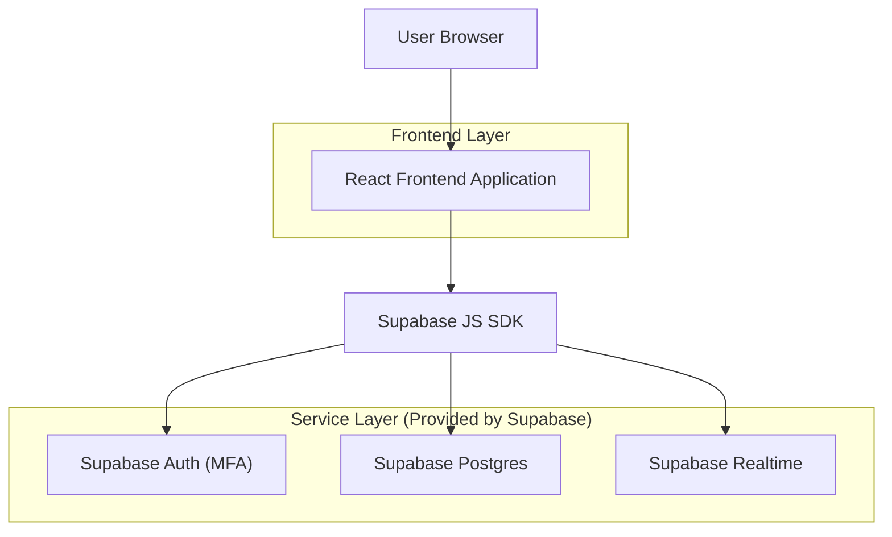

## 1.Architecture design


## 2.Technology Description
- Frontend: React@18 + TypeScript + react-router + tailwindcss@3 + vite
- Backend: Supabase (Auth com MFA + PostgreSQL + Realtime)

## 3.Route definitions
| Route | Purpose |
|-------|---------|
| /admin/login/delivery | Login do portal de entregas com MFA e verificação de papel |
| /admin/delivery | Painel de pedidos do dia (lista, detalhes inline, ações, histórico e notificações) |

## 6.Data model(if applicable)

### 6.1 Data model definition
**Entidades (sem FKs físicas; chaves lógicas por UUID):**
- `profiles`: `id (uuid=auth.uid)`, `role (delivery|admin)`, `display_name`, `active`, `created_at`.
- `suppliers`: dados do fornecedor (nome, contato, endereço completo).
- `orders`: pedido operacional do dia (campos mínimos de identificação, fornecedor, timestamps de fechamento e status atual).
- `order_assignments`: atribuições de pedido para entregador (`order_id`, `delivery_user_id`, `assigned_at`).
- `order_items`: itens a recolher (produto + variante) vinculados a um pedido/fornecedor.
- `order_item_acceptances`: aceite individual e/ou em massa (por fornecedor/pedido/item).
- `order_events`: trilha de eventos operacionais (`order_id`, `supplier_id`, `actor_user_id`, `type=ACCEPT_ALL|ACCEPT_ITEM|REPORT|RATE|NOTIF_READ|LOGIN`, `payload_json`, `created_at`).
- `order_ratings`: avaliação do fornecedor após coleta (`supplier_id`, `actor_user_id`, `rating 1-5`, `comment`, `created_at`).
- `issue_reports`: reporte de problemas vinculado ao fornecedor (e opcionalmente pedido/item) com observação.
- `issue_evidences`: evidências do reporte (imagens) com metadados e caminho de storage.
- `notifications`: notificações por usuário (`user_id`, `type`, `title`, `body`, `read_at`, `created_at`).

**Regras de acesso (RLS, alto nível):**
- `profiles`: usuário lê o próprio perfil; admin lê todos.
- `suppliers`: delivery lê apenas fornecedores relacionados a pedidos atribuídos; admin lê todos.
- `orders`: delivery lê pedidos atribuídos; admin lê todos.
- `order_assignments`: delivery lê suas atribuições; admin lê/cria/atualiza.
- `order_items` e `order_item_acceptances`: delivery lê/cria apenas em pedidos atribuídos; admin lê/cria em todos.
- `issue_reports` e `issue_evidences`: delivery cria e lê apenas em pedidos atribuídos; admin lê todos.
- `order_events` e `order_ratings`: delivery cria e lê apenas em pedidos atribuídos; admin lê todos.
- `notifications`: usuário lê e marca como lida apenas as suas.

### 6.2 Data Definition Language
```
-- PROFILES
CREATE TABLE profiles (
  id UUID PRIMARY KEY,
  role TEXT NOT NULL CHECK (role IN ('delivery','admin')),
  display_name TEXT,
  active BOOLEAN DEFAULT TRUE,
  created_at TIMESTAMPTZ DEFAULT NOW()
);

-- ORDERS
CREATE TABLE orders (
  id UUID PRIMARY KEY DEFAULT gen_random_uuid(),
  external_code TEXT,
  supplier_id UUID NOT NULL,
  closed_at TIMESTAMPTZ,
  scheduled_date DATE NOT NULL,
  status TEXT NOT NULL DEFAULT 'pending',
  customer_name TEXT,
  address_text TEXT,
  notes TEXT,
  created_at TIMESTAMPTZ DEFAULT NOW(),
  updated_at TIMESTAMPTZ DEFAULT NOW()
);
CREATE INDEX idx_orders_scheduled_date ON orders (scheduled_date);
CREATE INDEX idx_orders_closed_at ON orders (closed_at);
CREATE INDEX idx_orders_supplier_id ON orders (supplier_id);

-- SUPPLIERS
CREATE TABLE suppliers (
  id UUID PRIMARY KEY DEFAULT gen_random_uuid(),
  name TEXT NOT NULL,
  contact_name TEXT,
  contact_phone TEXT,
  contact_email TEXT,
  address_line1 TEXT,
  address_line2 TEXT,
  city TEXT,
  state TEXT,
  postal_code TEXT,
  country TEXT,
  created_at TIMESTAMPTZ DEFAULT NOW()
);

-- ORDER ITEMS
CREATE TABLE order_items (
  id UUID PRIMARY KEY DEFAULT gen_random_uuid(),
  order_id UUID NOT NULL,
  supplier_id UUID NOT NULL,
  product_name TEXT NOT NULL,
  variant_title TEXT,
  variant_description TEXT,
  variant_image_url TEXT,
  quantity INT NOT NULL DEFAULT 1,
  created_at TIMESTAMPTZ DEFAULT NOW()
);
CREATE INDEX idx_order_items_order_id ON order_items (order_id);
CREATE INDEX idx_order_items_supplier_id ON order_items (supplier_id);

-- ITEM ACCEPTANCES
CREATE TABLE order_item_acceptances (
  id UUID PRIMARY KEY DEFAULT gen_random_uuid(),
  order_item_id UUID NOT NULL,
  order_id UUID NOT NULL,
  supplier_id UUID NOT NULL,
  actor_user_id UUID NOT NULL,
  accepted_at TIMESTAMPTZ DEFAULT NOW(),
  method TEXT NOT NULL CHECK (method IN ('ALL','ITEM'))
);
CREATE INDEX idx_order_item_acceptances_supplier_id ON order_item_acceptances (supplier_id);
CREATE INDEX idx_order_item_acceptances_order_id ON order_item_acceptances (order_id);

-- ISSUE REPORTS
CREATE TABLE issue_reports (
  id UUID PRIMARY KEY DEFAULT gen_random_uuid(),
  supplier_id UUID NOT NULL,
  order_id UUID,
  order_item_id UUID,
  actor_user_id UUID NOT NULL,
  issue_type TEXT NOT NULL,
  notes TEXT,
  created_at TIMESTAMPTZ DEFAULT NOW()
);
CREATE INDEX idx_issue_reports_supplier_id ON issue_reports (supplier_id);
CREATE INDEX idx_issue_reports_created_at ON issue_reports (created_at DESC);

-- ISSUE EVIDENCES (Storage)
CREATE TABLE issue_evidences (
  id UUID PRIMARY KEY DEFAULT gen_random_uuid(),
  report_id UUID NOT NULL,
  storage_bucket TEXT NOT NULL,
  storage_path TEXT NOT NULL,
  content_type TEXT,
  created_at TIMESTAMPTZ DEFAULT NOW()
);
CREATE INDEX idx_issue_evidences_report_id ON issue_evidences (report_id);

-- ASSIGNMENTS
CREATE TABLE order_assignments (
  id UUID PRIMARY KEY DEFAULT gen_random_uuid(),
  order_id UUID NOT NULL,
  delivery_user_id UUID NOT NULL,
  assigned_at TIMESTAMPTZ DEFAULT NOW()
);
CREATE INDEX idx_order_assignments_order_id ON order_assignments (order_id);
CREATE INDEX idx_order_assignments_delivery_user_id ON order_assignments (delivery_user_id);

-- EVENTS
CREATE TABLE order_events (
  id UUID PRIMARY KEY DEFAULT gen_random_uuid(),
  order_id UUID NOT NULL,
  supplier_id UUID,
  actor_user_id UUID NOT NULL,
  type TEXT NOT NULL CHECK (type IN ('LOGIN','ACCEPT_ALL','ACCEPT_ITEM','REPORT','RATE','NOTIF_READ')),
  payload_json JSONB,
  created_at TIMESTAMPTZ DEFAULT NOW()
);
CREATE INDEX idx_order_events_order_id ON order_events (order_id);
CREATE INDEX idx_order_events_created_at ON order_events (created_at DESC);

-- RATINGS
CREATE TABLE order_ratings (
  id UUID PRIMARY KEY DEFAULT gen_random_uuid(),
  supplier_id UUID NOT NULL,
  actor_user_id UUID NOT NULL,
  rating INT NOT NULL CHECK (rating BETWEEN 1 AND 5),
  comment TEXT,
  created_at TIMESTAMPTZ DEFAULT NOW()
);
CREATE INDEX idx_order_ratings_order_id ON order_ratings (order_id);

-- NOTIFICATIONS
CREATE TABLE notifications (
  id UUID PRIMARY KEY DEFAULT gen_random_uuid(),
  user_id UUID NOT NULL,
  type TEXT NOT NULL,
  title TEXT NOT NULL,
  body TEXT,
  read_at TIMESTAMPTZ,
  created_at TIMESTAMPTZ DEFAULT NOW()
);
CREATE INDEX idx_notifications_user_id_created_at ON notifications (user_id, created_at DESC);

-- Baseline grants (ajuste com RLS habilitado)
GRANT SELECT ON profiles, suppliers, orders, order_assignments, order_items, order_item_acceptances, order_events, order_ratings, issue_reports, issue_evidences, notifications TO anon;
GRANT ALL PRIVILEGES ON profiles, suppliers, orders, order_assignments, order_items, order_item_acceptances, order_events, order_ratings, issue_reports, issue_evidences, notifications TO authenticated;
```

**Notas de implementação (essenciais):**
- MFA: habilitar MFA TOTP no Supabase Auth; exigir MFA na rota `/admin/login/delivery` antes de liberar o painel.
- Papel (delivery/admin): armazenar em `profiles.role` e validar tanto no cliente (UX) quanto via RLS (segurança real).
- Dia operacional: filtrar `orders.closed_at` entre `start = 00:00 do dia anterior` e `end = agora`.
- Notificações: usar `notifications` + Realtime para atualizar a lista sem refresh (quando aplicável).
- Evidências: armazenar imagens em Supabase Storage; gravar referência em `issue_evidences` e aplicar RLS/paths por usuário.
