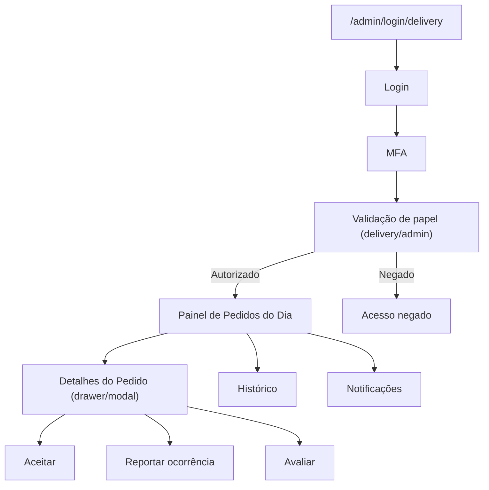

## 1. Product Overview
Aba/portal de entregadores acessada por `/admin/login/delivery`, com autenticação MFA e acesso restrito por papel (delivery/admin).
Permite operar o fluxo diário de entregas: ver pedidos do dia, aceitar, reportar ocorrências com evidências, avaliar fornecedores e consultar histórico/notificações.

## 2. Core Features

### 2.0 Definições importantes
- **Dia atual (dia operacional):** considerar como “dia atual” os pedidos fechados a partir de `00:00` do dia anterior até o momento atual.
- **Fornecedor:** agrupador principal do painel; um fornecedor pode ter vários pedidos e produtos para coleta.
- **Produto/Variante:** item que o entregador precisa recolher; a variante inclui atributos como cor, tamanho, SKU, descrição e imagens.
- **Ocorrência/Reporte:** registro de problema vinculado a um fornecedor (e opcionalmente a um pedido/produto), com observação e evidências.
- **Histórico de ações (audit trail):** registro imutável de todas as ações executadas no portal (login, MFA, aceite, reporte, avaliação, leituras de notificação etc.).

### 2.1 User Roles
| Role | Registration Method | Core Permissions |
|------|---------------------|------------------|
| Delivery | Criado/provisionado por Admin (usuário já existente no Auth) | Acessar apenas portal de entregas; ver pedidos atribuídos/do dia; aceitar pedido; reportar ocorrência; avaliar; ver histórico próprio; receber notificações. |
| Admin | Login normal + acesso à rota de delivery | Acessar portal de entregas; ver pedidos do dia (todos); operar aceite/reporte/avaliação conforme política interna; auditar histórico/notificações. |

### 2.2 Feature Module
Nossas necessidades consistem nas seguintes páginas principais:
1. **Login de Entregadores (Admin Delivery)**: login + MFA; verificação de papel (delivery/admin); tratamento de acesso negado.
2. **Painel de Pedidos do Dia**: lista do dia; detalhes do pedido (inline/drawer); ações de aceite/reporte/avaliação; histórico; notificações.

### 2.3 Page Details
| Page Name | Module Name | Feature description |
|-----------|-------------|---------------------|
| Login de Entregadores (Admin Delivery) | Autenticação | Autenticar usuário por e-mail/senha (ou SSO, se já existir no projeto). |
| Login de Entregadores (Admin Delivery) | MFA | Solicitar e validar segundo fator (TOTP/Authenticator); permitir revalidar em novo dispositivo conforme política. |
| Login de Entregadores (Admin Delivery) | Controle de acesso | Validar que o usuário autenticado tem papel `delivery` ou `admin`; bloquear acesso caso contrário. |
| Login de Entregadores (Admin Delivery) | Sessão | Manter sessão ativa; oferecer logout; redirecionar para painel após login/MFA válido. |
| Painel de Pedidos do Dia | Resumo do dia | Exibir contadores essenciais (ex.: total do dia, pendentes, aceitos, com ocorrência). |
| Painel de Pedidos do Dia | Lista de pedidos do dia | Listar pedidos do dia (atribuídos ao entregador quando papel=delivery; todos quando papel=admin); permitir atualizar/refresh. |
| Painel de Pedidos do Dia | Detalhes do pedido | Mostrar dados necessários para entrega (identificação, endereço, janela/horário, observações); abrir em drawer/modal sem sair da página. |
| Painel de Pedidos do Dia | Aceite do pedido | Registrar aceite com data/hora e responsável; refletir status imediatamente na lista. |
| Painel de Pedidos do Dia | Reporte de ocorrência | Registrar ocorrência (tipo + descrição curta); marcar pedido como “com ocorrência”; permitir anexar observação de texto. |
| Painel de Pedidos do Dia | Avaliação | Registrar avaliação pós-entrega (nota + comentário opcional curto). |
| Painel de Pedidos do Dia | Histórico | Exibir histórico de pedidos finalizados (filtros mínimos: período e status); acessar detalhes em modo somente leitura. |
| Painel de Pedidos do Dia | Notificações | Exibir lista de notificações (novas atribuições, mudanças de status, mensagens operacionais); marcar como lida. |

### 2.4 Regras de negócio (MVP)
- **Restrição de acesso:** apenas usuários com papel `delivery` ou `admin`.
- **MFA obrigatório:** usuários devem concluir MFA para entrar no painel (sem bypass).
- **Lista do dia:** trazer apenas pedidos dentro do “dia operacional”.
- **Agrupamento por fornecedor:** organizar a lista por fornecedor e permitir abrir detalhes por fornecedor.
- **Aceite em massa:** aceitar todos os produtos de um fornecedor em uma única ação.
- **Aceite individual:** aceitar produtos individualmente dentro do fornecedor.
- **Reporte com evidências:** abrir câmera no dispositivo para capturar evidências; permitir anexar pelo menos 1 evidência; registrar observação.
- **Avaliação pós-coleta:** após coleta bem-sucedida (todos aceitos sem pendências), permitir avaliar o fornecedor.
- **Atualizações em tempo real:** mudanças relevantes (novos pedidos/atribuições/status/notificações) devem atualizar o painel sem recarregar.

## 4. Segurança e conformidade
- **Validação segura de credenciais:** sem logs de senha/códigos; limitar tentativas; mensagens de erro genéricas.
- **Autorização defensiva:** validar papel no cliente (UX) e no servidor/banco (segurança efetiva).
- **Proteção de dados:** evidências (imagens) armazenadas com controle de acesso; URLs com expiração quando aplicável.
- **Auditoria completa:** toda alteração de estado e ação sensível gera evento de auditoria.

## 5. Critérios de aceitação (resumo)
- Usuário sem `delivery/admin` não consegue acessar `/admin/delivery`.
- Usuário autenticado sem MFA concluído não consegue acessar `/admin/delivery`.
- Painel lista somente pedidos do “dia operacional” e agrupa por fornecedor.
- Aceite em massa e aceite individual persistem e geram histórico.
- Reporte cria registro vinculado ao fornecedor e salva evidências + observação.
- Avaliação só fica disponível quando coleta do fornecedor está concluída.
- Notificações atualizam em tempo real e podem ser marcadas como lidas.

## 3. Core Process
**Fluxo de Acesso (Delivery/Admin)**
1. Você acessa `/admin/login/delivery`.
2. Você realiza login.
3. Você confirma o MFA.
4. O sistema valida seu papel (delivery/admin). Se inválido, bloqueia.
5. Você é redirecionado ao Painel de Pedidos do Dia.

**Fluxo Operacional (Pedidos do Dia)**
1. Você abre o Painel e vê a lista de pedidos do dia.
2. Você abre um pedido para ver detalhes.
3. Você aceita o pedido, ou registra uma ocorrência, e quando aplicável registra uma avaliação.
4. Você consulta o histórico para auditoria/consulta e acompanha notificações.

