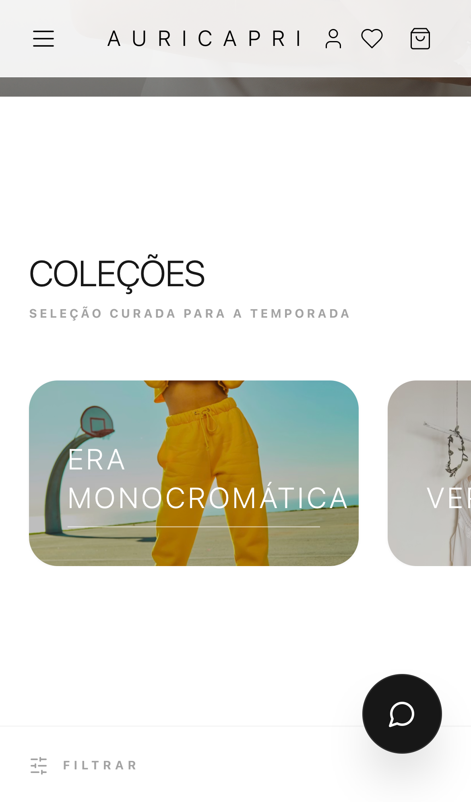
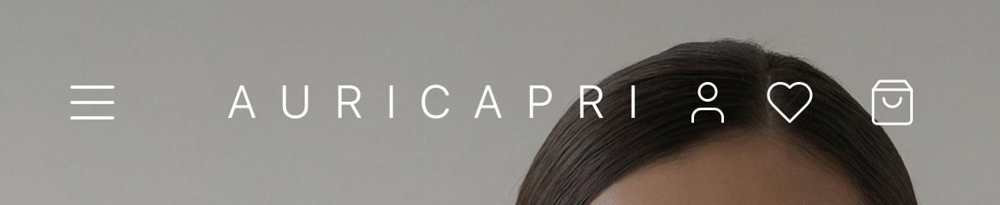
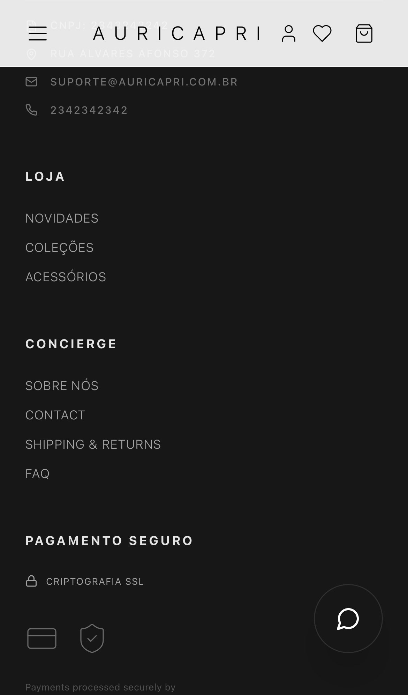
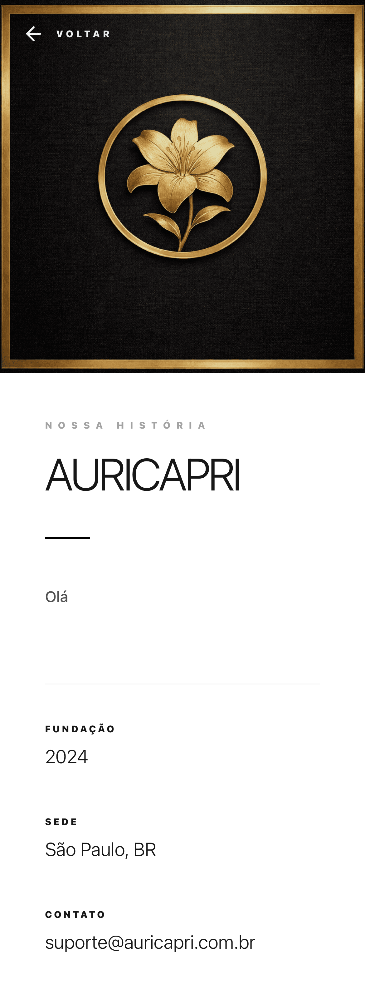
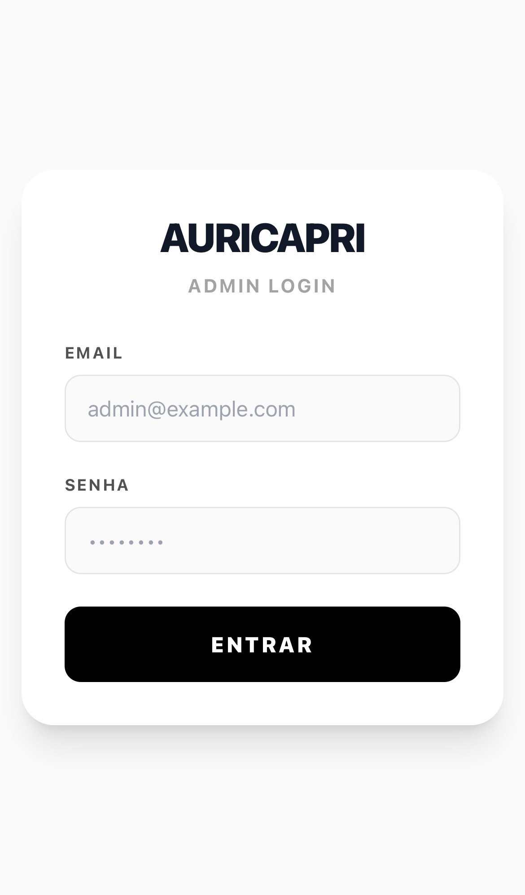

# Documentação Completa da Aplicação

Esta documentação foi gerada automaticamente pelo Playwright navegando por todas as páginas e capturando screenshots de tudo que foi encontrado.

## 📊 Estatísticas da Aplicação

Com base na análise automática, foram encontrados:
- **4 links** na homepage
- **36 botões** interativos
- **17 imagens**
- **1 navbar
- **2 seções** principais
- **1 card de produto** visível
- **1 coleção** encontrada

## 📸 Screenshots Gerados

### Navegação Principal

1. **Homepage no carregamento inicial**
   

2. **Homepage após scroll parcial**
   

3. **Homepage no final da página**
   

### Produtos e Coleções

4. **Estado dos produtos**
   

5. **Página de coleção**
   

6. **Coleções encontradas**
   

### Interações e Componentes

7. **Barra de navegação**
   

8. **Estado do carrinho**
   

9. **Drawer de autenticação**
   

### Páginas Específicas

10. **Página de checkout**
    

11. **Página sobre**
    

12. **Página administrativa**
    

### Estrutura e Análise

13. **Vista completa da estrutura**
    

### Responsividade

14. **Homepage em mobile**
    

15. **Homepage mobile após scroll**
    

16. **Homepage em tablet**
    

17. **Homepage em desktop grande**
    

### Navegação Automática

24+ - Screenshots de links importantes encontrados e visitados automaticamente

## 🚀 Como Gerar Nova Documentação

### Documentação Completa (recomendado):
```bash
npm run docs:full
```

### Documentação Completa com navegador visível:
```bash
npm run docs:full:headed
```

### Documentação Básica:
```bash
npm run docs
```

## 📝 O que os Testes Fazem

Os testes de documentação completa:

1. ✅ Navegam pela homepage em diferentes estados (inicial, scroll, final)
2. ✅ Procuram e tentam acessar produtos
3. ✅ Procuram e tentam acessar coleções
4. ✅ Interagem com navbar e menu
5. ✅ Abrem drawers (carrinho, wishlist, auth)
6. ✅ Visitam páginas específicas (checkout, about, admin)
7. ✅ Analisam a estrutura da página
8. ✅ Testam diferentes viewports (mobile, tablet, desktop)
9. ✅ Exploram links encontrados na página

## 🔍 Análise Automática

O sistema automaticamente:
- Conta elementos na página (links, botões, imagens, etc.)
- Identifica produtos, coleções e categorias
- Tenta interagir com elementos encontrados
- Documenta o estado de cada interação
- Gera logs de elementos encontrados

## 📂 Localização

Todos os screenshots estão em: `docs/screenshots/full/`

## 🎯 Próximos Passos

Para melhorar a documentação:
1. Adicione `data-testid` aos componentes principais
2. Certifique-se de que há dados de exemplo (produtos, coleções)
3. Execute `npm run docs:full` após mudanças significativas
4. Revise os screenshots gerados para validar a UI

## ⚠️ Notas

- Alguns screenshots podem não ser gerados se os elementos correspondentes não estiverem presentes
- Os seletores são genéricos e tentam encontrar elementos de várias formas
- A documentação é atualizada automaticamente a cada execução
- Screenshots antigos são sobrescritos

