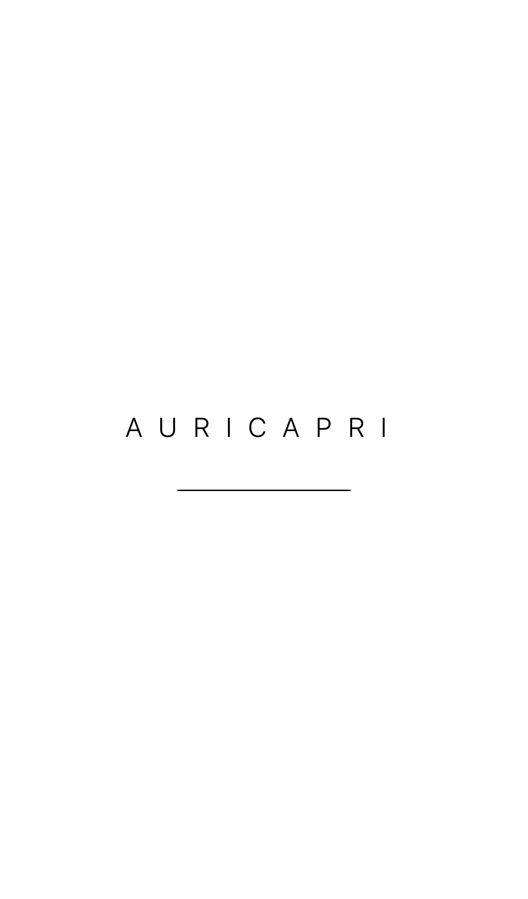
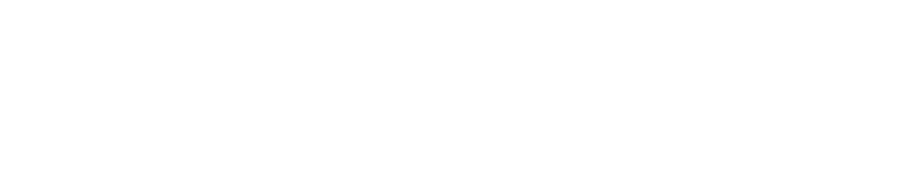
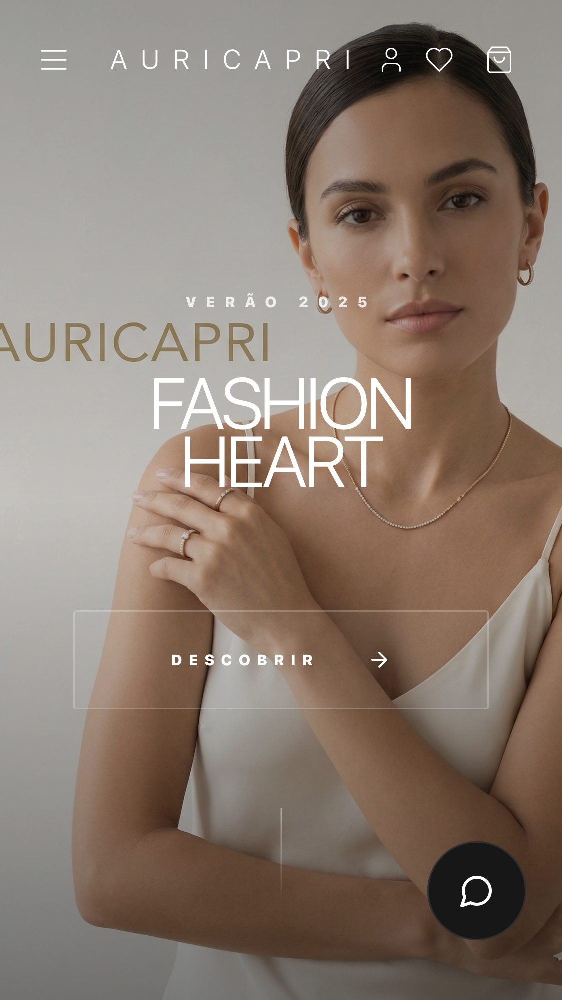

# Documentação Visual da Aplicação

Esta documentação foi gerada automaticamente usando Playwright para capturar screenshots das principais funcionalidades da aplicação.

## 📸 Screenshots Gerados

### Desktop

1. **Homepage Completa**
   
   - Vista completa da página inicial
   - Mostra toda a estrutura da homepage

2. **Hero Section**
   
   - Seção principal/banner da homepage
   - Primeira impressão visual

3. **Navbar**
   
   - Barra de navegação superior
   - Menu, carrinho, wishlist, etc.

4. **Grid de Produtos**
   
   - Listagem de produtos
   - Layout responsivo dos cards de produtos

### Mobile

5. **Homepage Mobile**
   
   - Versão mobile da homepage
   - Viewport: 375x667 (iPhone SE)

### Tablet

6. **Homepage Tablet**
   
   - Versão tablet da homepage
   - Viewport: 768x1024 (iPad)

## 🚀 Como Gerar Novos Screenshots

### Gerar todos os screenshots:
```bash
npm run docs
```

### Gerar com navegador visível (para debug):
```bash
npm run docs:headed
```

## 📝 Notas

- Os screenshots são atualizados automaticamente quando você executa os comandos acima
- Alguns screenshots podem não ser gerados se os elementos correspondentes não estiverem presentes na página
- Os seletores podem precisar ser ajustados conforme a estrutura da aplicação evolui

## 🔧 Configuração

Os testes de documentação estão configurados em:
- `playwright.docs.config.ts` - Configuração específica para documentação
- `tests/documentation.spec.ts` - Testes que geram os screenshots

## 📂 Localização

Todos os screenshots são salvos em: `docs/screenshots/`

## 🎯 Próximos Passos

Para adicionar mais screenshots:
1. Edite `tests/documentation.spec.ts`
2. Adicione novos testes seguindo o padrão existente
3. Execute `npm run docs` para gerar os novos screenshots

