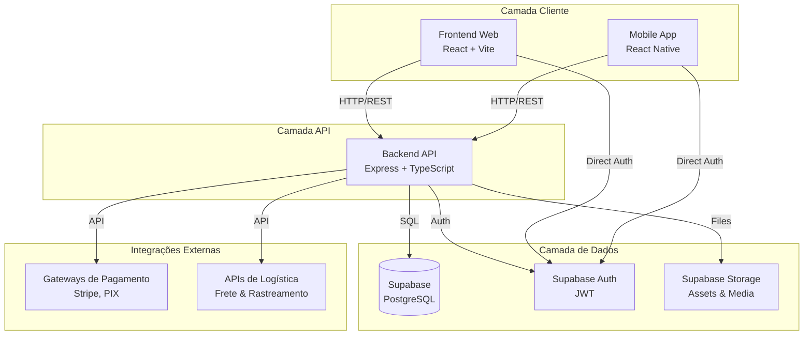
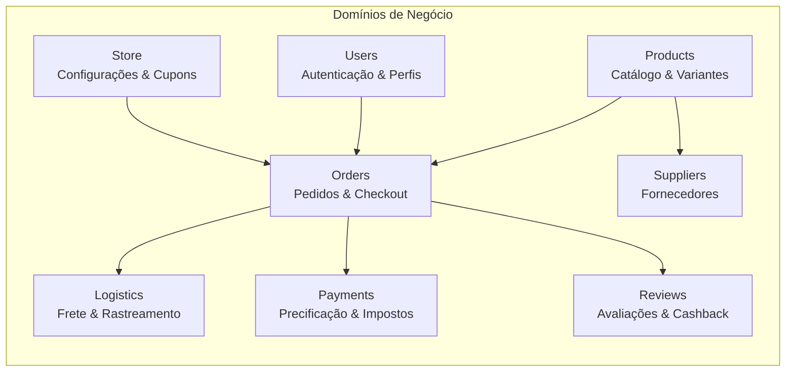
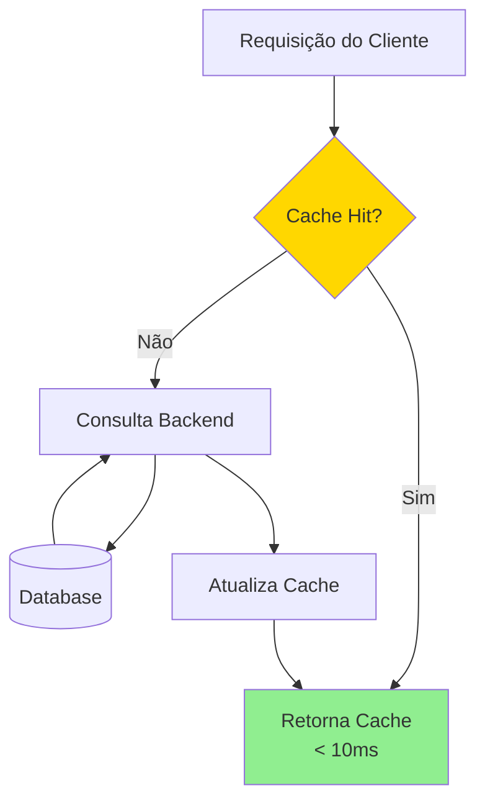
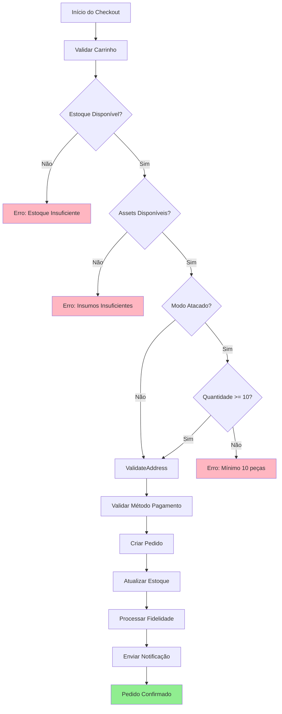
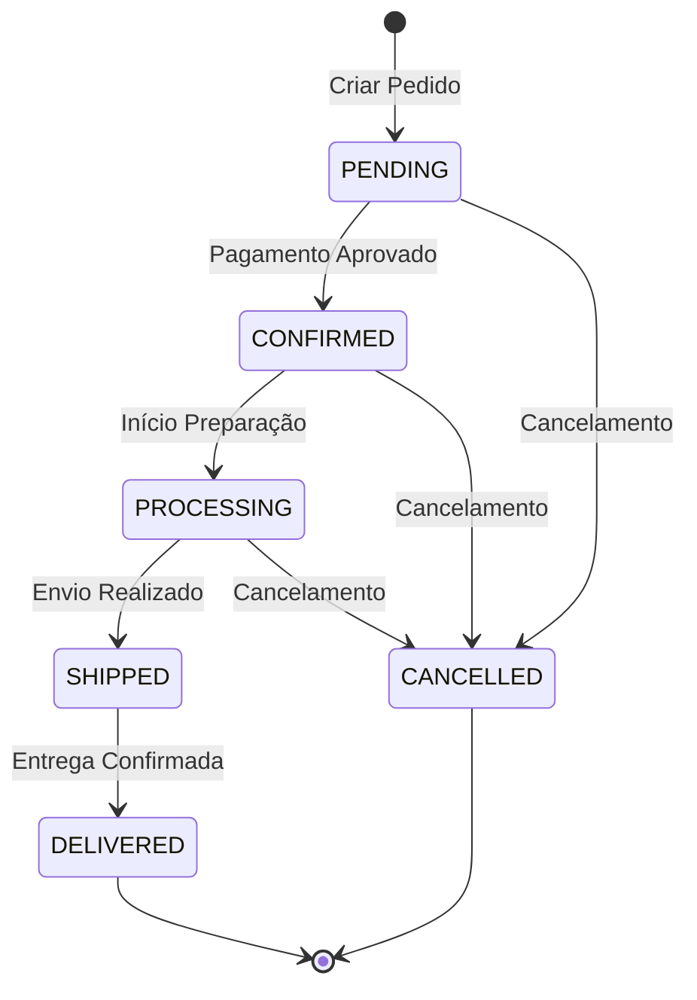
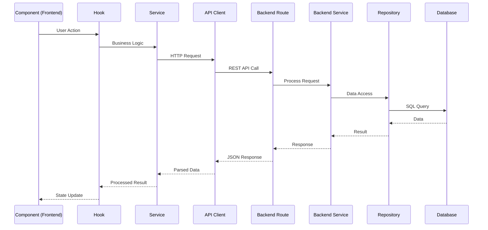

# Visão Técnica - Plataforma Auricapri

## Resumo Executivo

A Auricapri é uma plataforma de e-commerce de luxo construída com arquitetura moderna, escalável e robusta. A solução utiliza tecnologias de ponta para garantir alta performance, segurança e confiabilidade, atendendo tanto clientes finais (B2C) quanto parceiros comerciais (B2B).

**Stack Principal:**
- **Frontend Web**: React 19 + TypeScript + Vite
- **Mobile**: React Native + TypeScript
- **Backend**: Express + TypeScript + Node.js
- **Database**: Supabase (PostgreSQL)
- **Infraestrutura**: Vercel (Frontend) + Supabase Cloud

---

## 1. Arquitetura do Sistema

### 1.1 Visão Geral da Arquitetura



### 1.2 Organização por Domínios de Negócio

A plataforma é estruturada em 8 domínios principais, cada um com responsabilidades claras:



**Benefícios da Arquitetura:**
- **Separação de Responsabilidades**: Cada domínio é independente e testável
- **Escalabilidade**: Domínios podem ser escalados independentemente
- **Manutenibilidade**: Código organizado facilita evolução e correções
- **Type Safety**: TypeScript garante consistência em toda a aplicação

---

## 2. Performance e Tempos de Resposta

### 2.1 Estratégia de Cache

A plataforma implementa cache em múltiplas camadas para otimizar performance:



**Configurações de Cache por Tipo de Dado:**

| Tipo de Dado | TTL | Persistência | Tamanho Máx |
|-------------|-----|--------------|-------------|
| Produtos (Lista) | 5 min | Sim | 2 MB |
| Detalhe do Produto | 10 min | Sim | 500 KB |
| Categorias | 30 min | Sim | 100 KB |
| Coleções | 15 min | Sim | 200 KB |
| Banners | 30 min | Sim | 100 KB |
| Configurações da Loja | 60 min | Sim | 50 KB |
| Cupons | 10 min | Não | 200 KB |
| Assets | 60 min | Sim | 500 KB |
| Pedidos | 2 min | Não | 500 KB |

### 2.2 Tempos de Resposta Esperados

**Endpoints Principais:**

| Endpoint | Tipo | Tempo Médio | Com Cache |
|----------|------|-------------|-----------|
| Lista de Produtos | GET | 150-300ms | < 10ms |
| Detalhe do Produto | GET | 100-200ms | < 10ms |
| Criar Pedido | POST | 500-800ms | N/A |
| Calcular Preço | POST | 200-400ms | 5 min cache |
| Buscar CEP | GET | 300-500ms | 30 min cache |
| Autenticação | POST | 200-400ms | N/A |

**Otimizações Implementadas:**
- Cache em memória no frontend (localStorage + memory)
- Cache de configurações no backend (5 min TTL)
- Lazy loading de imagens e componentes
- Code splitting por rota
- Compressão de assets (gzip/brotli)

### 2.3 Disponibilidade

- **Target de Uptime**: 99.9% (máximo 8.76 horas de downtime/ano)
- **Infraestrutura**: Supabase Cloud (alta disponibilidade)
- **CDN**: Vercel Edge Network (distribuição global)
- **Backup**: Automático diário no Supabase
- **Monitoramento**: Logs estruturados e alertas em tempo real

---

## 3. Regras Negociais

### 3.1 Validações de Pedidos

O sistema aplica múltiplas camadas de validação antes de criar um pedido:



**Regras de Validação:**

1. **Estoque de Produtos**
   - Verifica quantidade disponível por variante
   - Bloqueia pedidos que excedem estoque

2. **Estoque de Assets (Embalagens)**
   - Calcula necessidade de embalagens baseado na quantidade
   - Valida disponibilidade de todos os insumos necessários

3. **Modo Atacado (B2B)**
   - Quantidade mínima: 10 peças por pedido
   - Validação aplicada antes do checkout

4. **Endereço de Entrega**
   - Validação de CEP via ViaCEP
   - Validação de campos obrigatórios

5. **Método de Pagamento**
   - Suporte: Cartão de Crédito e PIX
   - Validação de dados do pagamento

### 3.2 Transições de Status de Pedidos

O sistema controla rigorosamente as transições de status:



**Regras de Transição:**
- Apenas transições válidas são permitidas
- Histórico completo de mudanças é registrado
- Notificações automáticas em cada transição
- Cancelamentos podem ocorrer até PROCESSING

### 3.3 Regras de Precificação

O sistema calcula preços considerando múltiplos fatores:

**Componentes do Cálculo:**
1. **Custo Base**
   - Custo de produção da variante
   - Custo de assets (embalagens) necessários
   - Alocação de custos fixos mensais
   - Custo de devolução (3% taxa)
   - Custo de armazenamento (2% taxa)
   - Custo de perda (5% taxa)
   - Custo de frete (com sobretaxa para peso > 1000g)

2. **Impostos**
   - Regime tributário (MEI, Simples, Presumido, Real)
   - DAS proporcional (MEI: R$ 71,60)
   - ICMS, PIS, COFINS
   - IPI (quando aplicável)

3. **Taxas de Gateway**
   - Cartão de Crédito: 3.99% + R$ 0,50
   - PIX: 0.99%
   - Boleto: R$ 3,49 fixo
   - Parcelamento: +1.99% por parcela (máx 12x)

4. **Margem Alvo**
   - Configurável por cenário (ecommerce, marketplace, wholesale)
   - Considera CAC de marketing
   - Considera comissões de marketplace

**Fórmula de Precificação:**
```
Preço Sugerido = (Custo Total) / (1 - Margem% - Taxa Gateway% - Comissão% - Taxa Impostos%)
```

### 3.4 Regras de Modo Atacado vs Varejo

| Aspecto | Varejo (B2C) | Atacado (B2B) |
|--------|-------------|---------------|
| Quantidade Mínima | 1 peça | 10 peças |
| Preços | Preço de varejo | Preço com desconto |
| Acesso | Público | Requer aprovação |
| Fidelidade | Programa completo | Limitado |

---

## 4. Regras Estruturais

### 4.1 Fluxo de Dados



### 4.2 Padrões de Nomenclatura

**Convenções Estabelecidas:**

| Tipo | Padrão | Exemplo |
|------|--------|---------|
| Types/Interfaces | PascalCase | `Product`, `UserProfile` |
| Services | PascalCase + Service | `PricingService`, `OrderService` |
| APIs | PascalCase + Api | `ProductsApi`, `OrdersApi` |
| Repositories | PascalCase + Repository | `ProductsRepository` |
| Components | PascalCase | `ProductCard`, `CheckoutView` |
| Hooks | camelCase + use | `useCart`, `useAuth` |
| Utils | camelCase | `formatCurrency`, `calculatePrice` |

### 4.3 Organização de Tipos

Tipos organizados por domínio de negócio:

```
types/
├── common/          # Tipos compartilhados
├── products/        # Produtos, variantes, categorias
├── orders/          # Pedidos, carrinho, checkout
├── users/           # Usuários, perfis, endereços
├── payments/        # Pagamentos, precificação
├── reviews/         # Avaliações
├── suppliers/       # Fornecedores
├── store/           # Configurações da loja
└── dream/           # Dream Board
```

**Benefícios:**
- Facilita localização de tipos
- Reduz dependências circulares
- Melhora manutenibilidade
- Suporta code splitting

### 4.4 Gerenciamento de Estado

**Frontend:**
- **Context API**: Estado global (Auth, Cart, Store Data)
- **Local State**: Estado de componentes (`useState`)
- **Server State**: Dados do servidor via hooks customizados

**Backend:**
- **Stateless**: Cada requisição é independente
- **Cache em Memória**: Configurações e dados frequentes
- **Database**: Fonte única da verdade

---

## 5. Escalabilidade e Confiabilidade

### 5.1 Estratégias de Escalabilidade

**Horizontal Scaling:**
- Backend stateless permite múltiplas instâncias
- Load balancing automático (Vercel/Supabase)
- Database connection pooling

**Vertical Scaling:**
- Cache reduz carga no database
- Lazy loading reduz carga inicial
- Code splitting reduz bundle size

**Otimizações de Performance:**
- Compressão de assets (gzip/brotli)
- CDN para assets estáticos
- Image optimization automática
- Database indexing estratégico

### 5.2 Tratamento de Erros

**Camadas de Tratamento:**

1. **Frontend**
   - Validação de formulários (Zod)
   - Tratamento de erros de API
   - Fallbacks visuais para estados de erro
   - Retry automático para falhas de rede

2. **Backend**
   - Validação de entrada (Zod schemas)
   - Try-catch em operações críticas
   - Logging estruturado (Winston)
   - Respostas de erro padronizadas

3. **Database**
   - Constraints de integridade
   - Transações para operações atômicas
   - Rollback automático em falhas

### 5.3 Monitoramento e Logs

**Sistema de Logging:**
- **Nível**: INFO, WARN, ERROR
- **Formato**: JSON estruturado
- **Contexto**: Request ID, User ID, Timestamp
- **Retenção**: 30 dias (configurável)

**Métricas Monitoradas:**
- Tempo de resposta por endpoint
- Taxa de erro por endpoint
- Uso de cache (hit rate)
- Uso de recursos (CPU, memória)
- Conexões de database

### 5.4 Backup e Recuperação

**Backup Automático:**
- **Frequência**: Diária (Supabase)
- **Retenção**: 7 dias (configurável)
- **Localização**: Múltiplas regiões

**Recuperação:**
- Point-in-time recovery disponível
- Migrations versionadas
- Rollback de deployments (Vercel)

---

## 6. Segurança

### 6.1 Autenticação e Autorização

- **Autenticação**: Supabase Auth (JWT)
- **Autorização**: Role-based (Admin, Delivery, User)
- **Tokens**: JWT com expiração configurável
- **Refresh Tokens**: Renovação automática

### 6.2 Proteção de Dados

- **Criptografia**: TLS/SSL em todas as conexões
- **Dados Sensíveis**: Hash de senhas (bcrypt)
- **PCI Compliance**: Dados de cartão não armazenados
- **GDPR**: Conformidade com LGPD

### 6.3 Validação de Entrada

- **Schemas Zod**: Validação de tipos e formatos
- **Sanitização**: Limpeza de inputs do usuário
- **Rate Limiting**: Proteção contra abuso (futuro)

---

## 7. Métricas de Sucesso Técnico

### 7.1 Performance

- ✅ Tempo de resposta médio < 300ms (95% das requisições)
- ✅ Cache hit rate > 80%
- ✅ First Contentful Paint < 1.5s
- ✅ Time to Interactive < 3s

### 7.2 Confiabilidade

- ✅ Uptime target: 99.9%
- ✅ Taxa de erro < 0.1%
- ✅ Transações atômicas garantidas
- ✅ Zero perda de dados

### 7.3 Escalabilidade

- ✅ Suporta 1000+ requisições/minuto
- ✅ Database otimizado com índices
- ✅ Cache reduz carga em 80%+
- ✅ Arquitetura preparada para crescimento

---

## 8. Roadmap Técnico

### Melhorias Planejadas

1. **Performance**
   - Implementar Service Workers para cache offline
   - Otimizar queries de database com índices adicionais
   - Implementar GraphQL para queries mais eficientes

2. **Escalabilidade**
   - Implementar rate limiting
   - Adicionar queue system para processamento assíncrono
   - Implementar CDN para assets estáticos

3. **Monitoramento**
   - Dashboard de métricas em tempo real
   - Alertas proativos para degradação
   - Análise de performance por feature

4. **Segurança**
   - Implementar 2FA
   - Adicionar auditoria completa de ações
   - Implementar WAF (Web Application Firewall)

---

## Conclusão

A plataforma Auricapri foi desenvolvida com foco em **robustez**, **escalabilidade** e **performance**. A arquitetura moderna, baseada em domínios de negócio bem definidos, garante manutenibilidade e facilita evolução contínua. As estratégias de cache, validações rigorosas e tratamento de erros garantem uma experiência confiável para usuários e parceiros.

**Diferenciais Técnicos:**
- Arquitetura escalável e moderna
- Type safety em toda a stack
- Performance otimizada com cache multi-camada
- Validações robustas de regras de negócio
- Monitoramento e logging estruturado
- Infraestrutura cloud de alta disponibilidade

---

*Documento atualizado: Janeiro 2025*
*Versão: 1.0*
